# Phase 5 UI/UX Implementation Plan: "Guided Safety" Frontend (Project Podi)

## 1. Overview

This document outlines the UI/UX implementation plan for Phase 5 of Project Podi. The primary goal is to build the initial user-facing components, focusing on the Visual Service Composer and the first iteration of an Explainable AI (XAI) component. This phase directly supports the "Guided Safety" UX personality and the "Unified Trinity" (AI, UX, Extensibility) strategic mandates.

## 2. Technology Choice: Frontend Framework

*   **Framework**: React
*   **Justification**: As per the blueprint (Section 2.2), React is chosen for its:
    *   **Large Ecosystem**: Access to a vast number of libraries, tools, and community support.
    *   **Component-Based Architecture**: Ideal for building complex, reusable UI elements like those required for the Visual Service Composer and XAI components.
    *   **Talent Pool**: A large pool of developers proficient in React, beneficial for enterprise-scale projects.
    *   **Performance**: Virtual DOM and efficient update mechanisms contribute to a responsive user experience.
    *   **Strong Backing**: Maintained by Meta, ensuring continued development and stability.
    *   We will use `create-react-app` (or a similar modern Vite-based setup if preferred for faster development server) for initial project scaffolding.

## 3. Component Library

*   **Proposed Library**: Material-UI (MUI)
*   **Justification**:
    *   **Comprehensive Set of Components**: MUI offers a rich set of pre-built, customizable React components (buttons, forms, layout grids, icons, etc.) that will significantly accelerate development.
    *   **Professional Aesthetic**: It provides a clean, modern, and professional look and feel suitable for an enterprise platform, aligning with the "Guided Safety" principle of an expert co-pilot.
    *   **Theming and Customization**: MUI's theming system allows for extensive customization to match Project Podi's branding and specific UX requirements.
    *   **Accessibility**: MUI components are designed with accessibility (a11y) in mind.
    *   **Good Documentation**: Extensive documentation and active community support.
    *   **Popularity & Stability**: Widely adopted and battle-tested in many large applications.
    *   *Alternative considered*: Ant Design (AntD). AntD is also excellent but MUI's Material Design principles often feel slightly more intuitive for a broad range of enterprise users, and its customization story is very strong. The choice is not critical as both are good, but MUI is a slight preference for its design philosophy.

## 4. Visual Service Composer: Data Flow

The following sequence diagram illustrates the data flow from user interaction in the Visual Service Composer to the backend API call for deployment.

```mermaid
sequenceDiagram
    actor User
    participant Browser (React App)
    participant CanvasComponent
    participant PropertiesPanel
    participant BlueprintBuilderService (Frontend Logic)
    participant Nginx
    participant APIGatewayService (Backend)
    participant Kafka

    User->>Browser (React App): Drags "AWS EC2" from Toolbox to Canvas
    Browser (React App)->>CanvasComponent: Handles drop event, adds EC2 component instance to canvas state (e.g., with unique ID, type, default position)
    User->>CanvasComponent: Selects EC2 component instance on Canvas
    CanvasComponent->>PropertiesPanel: Notifies selection, passes component ID and type
    PropertiesPanel->>Browser (React App): Renders hardcoded form for "AWS EC2" (e.g., fields for instance size, AMI)
    User->>PropertiesPanel: Fills in EC2 properties (e.g., instance_size: "t3.large")
    PropertiesPanel->>CanvasComponent: Updates properties for the selected EC2 component instance in canvas state

    User->>Browser (React App): Drags "Ansible Tier" from Toolbox to Canvas
    Browser (React App)->>CanvasComponent: Handles drop, adds Ansible component instance to canvas state

    User->>Browser (React App): Clicks "Deploy" button
    Browser (React App)->>BlueprintBuilderService (Frontend Logic): Initiates blueprint generation from canvas state
    BlueprintBuilderService (Frontend Logic)->>CanvasComponent: Retrieves current state (list of components, their types, properties)
    BlueprintBuilderService (Frontend Logic)->>BlueprintBuilderService (Frontend Logic): Transforms canvas state into valid Blueprint YAML string
    Note right of BlueprintBuilderService (Frontend Logic): Example YAML generated:\napiVersion: cognitive-cmp.io/v1\nkind: Blueprint\nmetadata:\n  name: visual-bp-123\nspec:\n  inputs: [] # Simplified for Phase 5\n  tiers:\n    - name: aws-ec2-instance-0\n      type: terraform # Assuming default mapping for now\n      variables:\n        instance_type: "t3.large"\n    - name: ansible-tier-1\n      type: ansible\n      source: { git: "placeholder.git" } # Placeholder

    BlueprintBuilderService (Frontend Logic)->>Nginx: POST /api/v1/blueprints/visual-bp-123/deploy (with YAML payload)
    Nginx->>APIGatewayService (Backend): Proxies POST /api/v1/blueprints/visual-bp-123/deploy
    APIGatewayService (Backend)->>Kafka: Publishes blueprint YAML to "blueprint.deployment.requested" topic
    APIGatewayService (Backend)-->>Nginx: Returns 202 Accepted (or error)
    Nginx-->>BlueprintBuilderService (Frontend Logic): Returns 202 Accepted (or error)
    BlueprintBuilderService (Frontend Logic)->>Browser (React App): Displays success/error message to User
```



**Key Data Structures (Frontend State - Simplified for Phase 5):**
*   `canvasComponents`: An array of objects, e.g.:
    ```javascript
    [
      { id: 'comp_1', type: 'AWS_EC2_INSTANCE', x: 100, y: 50, properties: { instance_size: 't3.medium', ami_id: 'ami-123' } },
      { id: 'comp_2', type: 'ANSIBLE_PLAYBOOK_TIER', x: 300, y: 150, properties: { git_repo: 'my/ansible.git', playbook_path: 'main.yml' } }
    ]
    ```
*   `selectedComponentId`: String or null.

## 5. Wireframes

### 5.1. Visual Service Composer

```
+------------------------------------------------------------------------------------------------------------+
| Project Podi - Visual Service Composer - [Blueprint Name: MyHybridApp]                                     |
+------------------------------------------------------------------------------------------------------------+
| [File] [Edit] [View] [Help]                                                                                |
+------------------------------------------------------------------------------------------------------------+
| Component Toolbox (Left Panel)      | Canvas (Center Panel)                     | Properties Panel (Right)   |
|-------------------------------------|-------------------------------------------|----------------------------|
| [Search Components...]              |                                           |                            |
|                                     |                                           | [No Component Selected]    |
| --- Compute ---                     |        +-----------------+                | OR                         |
| [*] AWS EC2 Instance (draggable)    |        | AWS EC2 Inst... | (dropped)      | --- AWS EC2 Instance ---   |
| [*] OpenStack VM (draggable)        |        | id: comp_1      |                | Name: [web-server-1]       |
| [*] KVM VM (draggable)              |        +-----------------+                | Size: [t3.medium (v)]      |
|                                     |                                           | AMI:  [ami-0abcdef (v)]    |
| --- Storage ---                     |                                           | Tags:                      |
| [*] S3 Bucket (draggable)           |                                           | Key:   [Environment ]      |
| [*] EBS Volume (draggable)          |   +-------------------+                   | Value: [Production  ]      |
|                                     |   | Ansible Tier    | (dropped)         | [Add Tag]                  |
| --- Networking ---                  |   | id: comp_2      |                   |                            |
| [*] VPC (draggable)                 |   +-------------------+                   | --- Ansible Tier ---       |
| [*] Load Balancer (draggable)       |                                           | Name: [app-config  ]       |
|                                     |                                           | Source Git: [git@..]       |
| --- IaC & Config ---                |                                           | Playbook: [deploy.yml]     |
| [*] Terraform Tier (draggable)      |                                           | Variables:                 |
| [*] Ansible Playbook Tier (draggable)|                                           | Key:   [db_user     ]      |
|                                     |                                           | Value: [app_user     ]      |
| --- Custom Blueprints ---           |                                           | [Add Variable]             |
| [*] 3-Tier Web App (draggable)      |                                           |                            |
|                                     |                                           |                            |
| (Scrollable list)                   | (Zoom/Pan controls eventually)            | (Scrollable form)          |
|                                     |                                           |                            |
+-------------------------------------|-------------------------------------------|----------------------------+
| Status: Ready                       | [Validate Blueprint]  [Save Blueprint] [Deploy Blueprint]              |
+------------------------------------------------------------------------------------------------------------+
```
*   `(*)` denotes a draggable item.
*   `(v)` denotes a dropdown/select input.
*   `[Text]` denotes a text input field.
*   The "Deploy Blueprint" button will trigger the data flow described above.

### 5.2. Explainable AI (XAI) Component (on a Dashboard Page)

```
+------------------------------------------------------------------------------------------------------------+
| Project Podi - Operations Dashboard                                                                        |
+------------------------------------------------------------------------------------------------------------+
| [Overview] [Resource Management] [AI Insights] [Cost Optimization] [User Settings]                         |
+------------------------------------------------------------------------------------------------------------+
| AI Recommendations / Insights                                                                              |
|------------------------------------------------------------------------------------------------------------|
|                                                                                                            |
|   +------------------------------------------------------------------------------------------------------+   |
|   | **Insight:** Recommendation: Resize VM `web-prod-03` from `t3.xlarge` to `t3.large`.                  |   |
|   | *Projected monthly savings: $85.*                                                                    |   |
|   |                                                                                                      |   |
|   | [Dismiss]  [Show Evidence >>] (Button or Link)                                                       |   |
|   +------------------------------------------------------------------------------------------------------+   |
|                                                                                                            |
|   +------------------------------------------------------------------------------------------------------+   |
|   | **Insight:** Critical Alert: Application `checkout-api` is experiencing high latency.                |   |
|   | *Recommended Action: Roll back deployment v1.2.1.*                                                   |   |
|   |                                                                                                      |   |
|   | [Acknowledge] [Show Evidence >>]                                                                     |   |
|   |                                                                                                      |   |
|   |   --- Evidence View (Toggled by "Show Evidence >>", initially hidden) ---                            |   |
|   |   **Reasoning for Latency Alert & Rollback:**                                                        |   |
|   |   The latency spike for `checkout-api` directly correlates with the deployment of version `v1.2.1`.  |   |
|   |   Retrieved logs from this deployment show a new database query (`SELECT * FROM user_orders ...`)    |   |
|   |   being introduced. This query is performing a full table scan on a large table, which is the        |   |
|   |   likely cause of the performance degradation. Rolling back to the previous stable version `v1.2.0`  |   |
|   |   is the recommended immediate action to restore service.                                            |   |
|   |                                                                                                      |   |
|   |   **Supporting Data:**                                                                               |   |
|   |   +--------------------------------------+  +--------------------------------------+                 |   |
|   |   | API P95 Latency (checkout-api)       |  | Host CPU Utilization (checkout-pods) |                 |   |
|   |   |      ^ ms                          |  |      ^ %                           |                 |   |
|   |   |  2000|    .--.                     |  |   80 |         .--.               |                 |   |
|   |   |  1000|   /    \   /                |  |   40 |        /    \              |                 |   |
|   |   |     0+---+-----+--X--+---> time    |  |    0 +--------+--X---+---> time   |                 |   |
|   |   |          ^ Deployment v1.2.1         |  |                   ^ Deployment v1.2.1|                 |   |
|   |   +--------------------------------------+  +--------------------------------------+                 |   |
|   |   (Static image of a chart for Phase 5)   (Static image of a chart for Phase 5)    |   |
|   |                                                                                                      |   |
|   |   [Hide Evidence <<]                                                                                 |   |
|   +------------------------------------------------------------------------------------------------------+   |
|                                                                                                            |
+------------------------------------------------------------------------------------------------------------+
```

## 6. Next Steps

Upon approval of this UI/UX Implementation Plan, development will commence on scaffolding the React application, building the Visual Service Composer components, and implementing the initial XAI display component. NGINX configuration will also be updated to serve the frontend and proxy API calls.
The focus for Phase 5 is on the structural implementation and basic interactivity; advanced features like drawing connections in the composer or live data for XAI will be future enhancements.
